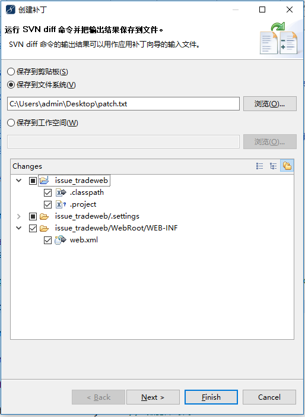
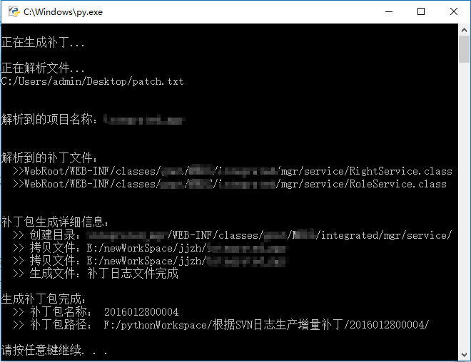

# pAutoPackJW

[](https://www.python.org/downloads/release/python-300/)
[](http://github.com/hhyo/archery/blob/master/LICENSE) 

## 介绍

使用 Python 编写的根据 SVN 日志自动打补丁包的脚本，目前仅支持 java web 项目

## 功能或特征

1. 根据 SVN 创建补丁后的 TXT 文件自动生成补丁；
2. 支持自动生成源文件与 class 文件；
3. 支持文件过滤功能；
4. 支持自动生成补丁包名称功能；
5. 支持配置默认路径与手动选择路径；
6. 支持内部类的 class 文件生成；
7. 支持补丁文件的修改时间与访问时间与源文件一致
8. ...

最新版的功能更新，请参见：[pAutoPatchJW_更新日志.md](https://github.com/kentTanL/aAutoPackJw/blob/master/pAutoPatchJW_更新日志.md)

## 使用说明

注：使用前需要下载Python 3.x版本，建议使用3.5或以上版本（本脚本在 Python 3.5 +Windows 开发，并未测试在其他环境下的运行结果）

### 1.1 生成Svn补丁日志

右键项目 -> Team -> 创建补丁，弹出如下界面。



选择所需补丁文件，并选择保存到文件系统，然后点 ’Finish’，就会在指定位置生成一个 txt 的文档，这里的名称为 patch.txt。

### 1.2 启动脚本

生成patch.txt后，便可以启动脚本，如果不配置属性文件，则操作如下：

- 1) 双击start.py文件，或者在cmd窗口输入”python start.py”； 
- 2) 弹出选择框，选择刚刚生成的patch.txt文件； 
- 3) 选择完文件后，需要进一步在弹出框选择项目空间的位置； 
- 4) 生成完成，生成完成后的界面如下图（这里并非1.1中对应选择的文件）。



但是对于上面的操作，还是太麻烦了，必须得选择补丁日志文件的位置，竟然还要选择项目空间的位置。好，既然大家都觉得麻烦，那么就需要用上配置文件了，配置文件代码如下：
config.properties

```shell
# 这是补丁生成器的配置文件
# 其规则遵循[属性名=属性值]的规则，不允许留空格

# SVN创建补丁日志文件默认路径
DEFAULT_SVN_LOG_PATH=C:/Users/admin/Desktop/patch.txt

# 是否使用SVN补丁日志文件默认位置，1:是，0：否，这关系着是否弹出选择框选择文件
IS_DEFAULT_SVN_LOG_PATH=1

# 工作空间默认位置，可为空
DEFAULT_WORKSPACE_PATH=E:/newWorkSpace/jjzh

# 是否使用工作空间默认位置，1:是，0：否，这关系着是否弹出选择框选择文件
IS_DEFAULT_WORKSPACE_PATH=1
```

因为 Svn 补丁日志文件与项目空间都是极少改动的，并且 Svn 日志文件只要在生成的时候选择同样一个位置便不需要以后每次启动脚本都去选择它的位置，对于项目空间的位置，尽管项目发生改变的几率很大，但是项目空间则相对发生改变的纪律相对较小，所以使用上面的配置则可以省去选择操作，那么改变配置文件后的操作如下（配置文件的位置路径需要保证正确）：

- 1) 双击 start.py 文件，或者在cmd窗口输入`python start.py`； 
- 2) 生成完成，其界面如上图。 

需要说明的是，FILTER_EXTEN 的值将影响生成补丁的文件，只有后缀名符合的文件才会被生成，而 FILTER_TARGET_DIR 的值将影响生成的文件夹，即以这个数组中值开头的文件夹将去掉此值为名称的文件夹（仅限开头），这是因为Java源文件编译后的目录可能在 WebRoot 目录下，但是 Tomcat 部署中却不需要以此文件夹开头。
